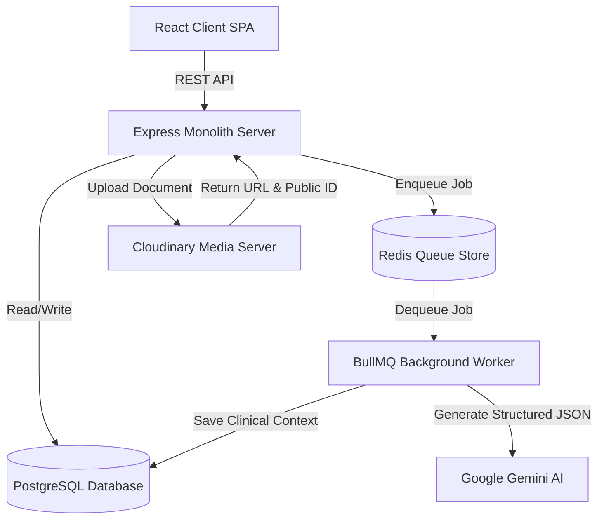
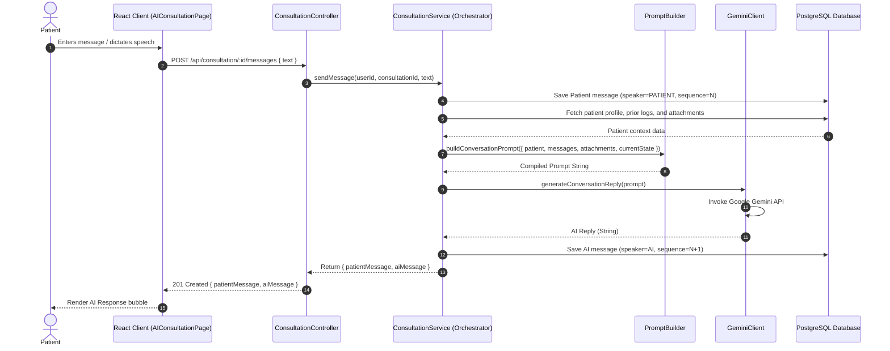
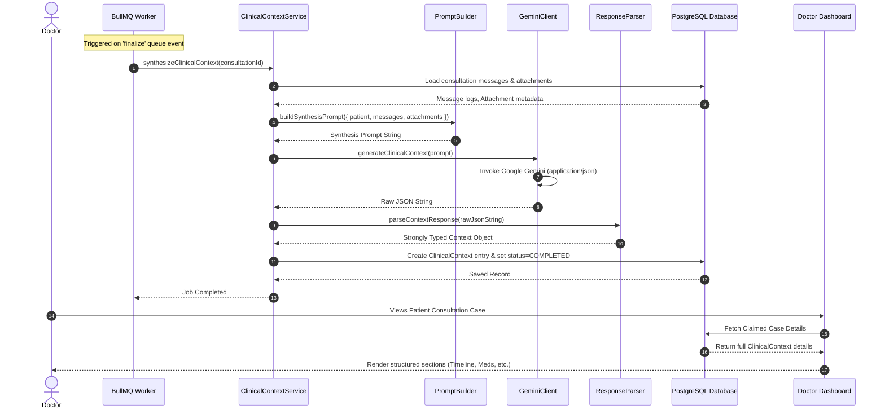

# CortexCare AI Clinical Intake Platform Architecture

This document maps the architectural framework of the CortexCare AI Clinical Intake Platform. The platform enables patients to conduct pre-consultation intake sessions with an empathetic AI assistant that compiles structured medical information and files, generating a comprehensive clinical summary for doctors.

---

## 1. High-Level Architecture Overview

CortexCare is structured as a **Modular Monolith** on the backend and a **Feature-Sliced React SPA** on the frontend. The system decouples interactive patient conversation from background clinical processing using a message queue.



---

## 2. Request & Execution Flows

### A. Conversation Flow (Realtime Text & Dictation)
Patients describe symptoms, medical history, and upload records. The conversation helper asks one concise follow-up question at a time to complete the profile.



### B. Clinical Context Synthesis Flow (Asynchronous Background Job)
When the patient clicks "Finish Consultation", the session is locked, and a BullMQ job handles structured context extraction in the background.



---

## 3. Folder Structure Blueprint

The folder hierarchy encapsulates all clinical intake logic under vertical slices.

### Frontend Folder Structure (`client/src/features/consultation/`)
```text
consultation/
├── api/
│   └── consultationApi.js       # API methods (create, fetch, send, upload, finalize)
├── components/
│   ├── AIConsultationPage.jsx   # Primary consultation screen controller
│   ├── ChatWindow.jsx           # Scrolling viewport for message history
│   ├── ChatInput.jsx            # Textarea input with Speech-to-Text mic button
│   ├── MessageBubble.jsx        # Single message item (Patient/AI/System)
│   ├── UploadPreview.jsx        # Preview pane for files queued for upload
│   └── SessionAttachments.jsx   # Right panel listing uploaded documents
└── hooks/
    └── useSpeechToText.js       # Browser-native SpeechRecognition wrapper hook
```

### Backend Folder Structure (`server/src/modules/consultation/`)
All consultation logic is consolidated inside the `consultation/` slice:
```text
consultation/
├── controllers/
│   └── consultation.controller.js   # Parses requests, delegates to services
├── services/
│   ├── consultation.service.js      # Session lifecycle & message routing service
│   ├── attachment.service.js        # File uploads, Cloudinary sync & text extractor
│   └── clinicalContext.service.js   # Background BullMQ synthesis processor service
├── ai/
│   ├── PromptBuilder.js             # Compiles LLM prompts with exact context state
│   ├── GeminiClient.js              # Interacts with the @google/genai SDK
│   └── ResponseParser.js            # Validates and structures Gemini JSON outputs
├── queues/
│   └── consultation.queue.js        # BullMQ queue declaration
└── workers/
    └── consultation.worker.js       # BullMQ worker process running background synthesis
```

---

## 4. Structured Database Design

The data layer supports comprehensive intake summaries and attachments:

### Consultation (`consultations` Table)
- Represents a single intake episode. Transitions: `SETUP` ➔ `ACTIVE` ➔ `PROCESSING` ➔ `COMPLETED` / `FAILED`.

### Message (`messages` Table)
- Replaces the generic transcript chunks. Captures chronological chat bubbles.
- Columns: `id`, `consultationId`, `speaker` (`PATIENT` | `AI` | `SYSTEM`), `text`, `sequence`, `createdAt`.

### Attachment (`attachments` Table)
- Stores files processed through Cloudinary.
- Columns: `id`, `consultationId`, `fileName`, `fileType`, `cloudinaryUrl`, `publicId`, `extractedText`, `uploadedAt`.

### ClinicalContext (`clinical_contexts` Table)
- 1-to-1 association with `Consultation`. Stores the structured output generated by Gemini:
  - `chiefComplaint`: String summary of the main concern.
  - `presentIllness`: Structured text mapping history of present illness.
  - `pastMedicalHistory`: Json list of chronic conditions, surgeries.
  - `currentMedications`: Json list of current medications.
  - `allergies`: Json list of drug/food allergies.
  - `lifestyle`: Json details of smoking, drinking, exercise.
  - `symptoms`: Json list of reported symptoms.
  - `timeline`: Json timeline log of symptom onset and progression.
  - `riskFactors`: Json list of red-flag symptoms or safety factors.
  - `riskLevel`: `LOW` | `MEDIUM` | `HIGH` string.
  - `recommendedSpecialist`: Target medical provider specialty.
  - `doctorSummary`: Comprehensive, human-readable summary block.
  - `consultationState`: JSON object storing state flags:
    ```json
    {
      "knownSymptoms": [],
      "missingInformation": [],
      "conversationComplete": false
    }
    ```
